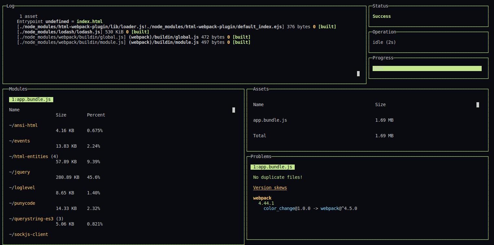

# The color change project 
> the goal is to convert a string into a HEX color 🌈

[](https://www.linkedin.com/in/roland-lopez-developer/?locale=en_US)
[](https://standardjs.com)
[](https://nodejs.org/en/)
[](https://webpack.js.org/)

## How to test:
```
# cd into your working dir.

# pull the project:
$ git clone git@github.com:letItCurl/color_change.git
# or
$ git clone https://github.com/letItCurl/color_change.git

# install dependencies:
$ yarn install

# run the project:
$ npm run start
```

***Then the browser is opened automatically and the terminal becomes this beautiful dashboard from the NASA***



Just enter a seed in the input form, in the browser.

The color of the screen will change within a define range of color ☄️

# About me

<table style="border: none;">
  <tr>
    <td>
      <div style="width: 120px;">
        
    </div>
    </td>
    <td>
      <div style="margin-left: 30px;">
        <p>Hey there !</br>
        I'm letItCurl, fullstack developer engineer in freelance.</br>
        If you have any question you can <a href="https://www.linkedin.com/in/roland-lopez-developer/?locale=en_US">contact me</a> if you wish !</p>
        <p>I'm always ready to help !</p>
        <a href="mailto:rolandlopez.developer@gmail.com?subject=H3y!4r3ù4va1la8le?">Email me</a>
    </div>
    </td>
  </tr>
</table>